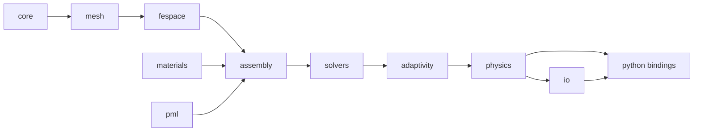

# Architecture

| Module | Responsibility | Key types |
|---|---|---|
| core | scalar types, constants, errors, logging | `Real`, `Complex`, `Index`, `Error` |
| mesh | topology (vertices/edges/faces/cells), tags, geometry maps, refinement, Gmsh I/O | `Mesh<Dim>`, `SimplexTopology<Dim>`, `GeometryMap` |
| fespace | reference elements, quadrature, H1 and H(curl) bases, DoF numbering, constraints | `ReferenceElement`, `NedelecBasis`, `DofMap`, `Constraints` |
| assembly | element kernels, global sparse assembly, boundary terms | `Assembler`, `ElementMatrix` |
| materials | ε(ω), μ tensors, dispersion models, material database | `Material`, `Drude`, `Tabulated` |
| pml | complex stretching → effective tensors | `PmlLayer`, `StretchedMaterial` |
| solvers | direct/iterative linear solvers, eigensolvers, parameter sweeps | `DirectSolver`, `ShiftInvertEigen` |
| adaptivity | estimators, marking, hp decision, refinement driver | `ResidualEstimator`, `HpLoop` |
| physics | problem classes: scattering, resonance, propagating mode; post-processing | `Scattering`, `Resonance`, `Postprocess` |
| io | VTK/XDMF export, JSON project files, checkpoints | `VtkWriter`, `Project` |

Dependencies point strictly left-to-right; `python/` sits on top of everything.

## Data flow of one adaptive solve

1. `io::Project` loads geometry (Gmsh), materials, sources, BCs, targets.
2. `mesh::Mesh` is built; PML layer cells are tagged.
3. `fespace::DofMap` numbers DoFs for the initial order $p_0$ per cell.
4. `assembly::Assembler` builds $S - \omega^2 M$ with `materials` and `pml` callbacks.
5. `solvers` solve; `physics::Postprocess` evaluates targets.
6. `adaptivity` estimates, marks, decides h/p, refines; `DofMap` is rebuilt; loop.
7. `io` writes fields and results.
